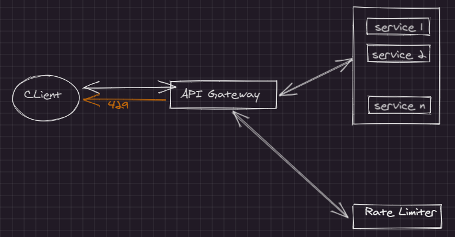

# Rate Limiter using Spring Cloud Gateway

## Architecture

## Code Changes

The following config enables rate limiters and routes the traffic to backend instance which is a helloworld service.
This app runs on `8080` port.
